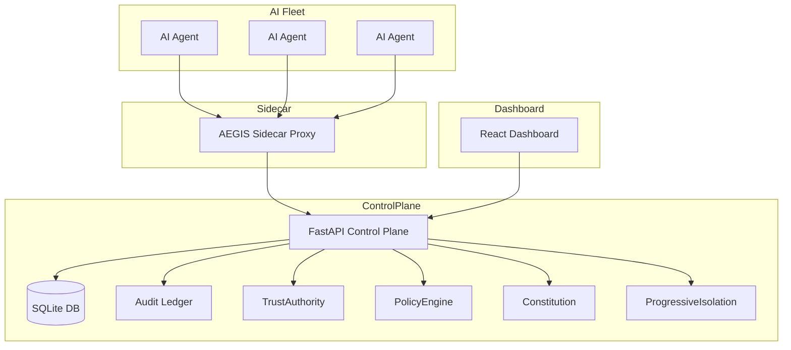

# 🛡️ AEGIS – AI Enforcement & Governance Infrastructure System

## Table of Contents
- [Project Overview](#project-overview)
- [Key Concepts](#key-concepts)
- [Architecture Diagram](#architecture-diagram)
- [Backend (Control Plane)](#backend-control-plane)
  - [Database Schema](#database-schema)
  - [API Endpoints](#api-endpoints)
  - [Core Engines](#core-engines)
- [Frontend (Dashboard UI)](#frontend-dashboard-ui)
  - [Views & Navigation](#views--navigation)
  - [Styling & Design System](#styling--design-system)
- [Simulator Orchestrator](#simulator-orchestrator)
- [Governance & Policy Engine](#governance--policy-engine)
- [Deployment & Running Locally](#deployment--running-locally)
- [Testing & Verification](#testing--verification)
- [Contribution Guidelines](#contribution-guidelines)
- [License](#license)

---

## Project Overview
**AEGIS** is an enterprise‑grade security control plane for autonomous AI agents. It enforces **Zero‑Trust** policies, provides **cryptographic identity**, maintains an **immutable audit ledger**, and offers a **real‑time dashboard** for monitoring and managing AI fleets.

The system consists of three major parts:
1. **Backend (FastAPI)** – Handles identity issuance, policy evaluation, audit logging, and persistence via SQLite/SQLModel.
2. **Frontend (React + Vite)** – A premium, glass‑morphism‑styled dashboard with interactive controls for identity issuance, global purge, simulator orchestration, and forensic logs.
3. **Simulator** – A realistic fleet simulator that generates diverse AI behaviours and security events for testing the control plane.

---

## Key Concepts
| Concept | Description |
|---------|-------------|
| **Identity (ED25519)** | Each AI agent receives a cryptographic identity (public/private key pair) issued by the `TrustAuthority`. All intents are signed and verified. |
| **Zero‑Trust Service Mesh** | Every request passes through the AEGIS side‑car proxy, which validates signatures, checks policies, and enforces isolation levels. |
| **Constitution** | Immutable safety invariants (e.g., `PROHIBIT DELETE_SYSTEM_CORE`) that **cannot** be overridden by any policy. |
| **Contas Scale** | 10‑level isolation scale (`L10` full access → `L0` isolated). Trust scores drive the level. |
| **Immutable Audit Ledger** | Hash‑chained log entries (`SHA‑256(prev_hash || data)`) provide tamper‑evident forensic evidence. |
| **Simulator Orchestrator** | UI tab to start/stop/reset the fleet, view live stats, and inject penalties. |
| **Governance Setup** | Placeholder for future policy authoring UI – currently shows database sync status. |

---

## Architecture Diagram

---

## Backend (Control Plane)
The backend lives under `backend/src/aegis/` and is built with **FastAPI**.

### Database Schema
```python
class Agent(SQLModel, table=True):
    id: str = Field(primary_key=True)
    trust_score: float = Field(default=100.0)
    status: str = Field(default="Active")  # Active, REVOKED, ISOLATED
    level: int = Field(default=10)          # Contas scale 0‑10
    mode: str = Field(default="NORMAL")   # NORMAL, ISOLATED, etc.

class AuditLog(SQLModel, table=True):
    id: Optional[int] = Field(default=None, primary_key=True)
    timestamp: datetime = Field(default_factory=datetime.utcnow)
    ai_id: str
    intent: str
    decision: str
    reason: str
    signature: str
    previous_hash: str = Field(default="0")
    current_hash: str = Field(default="0")

class GlobalStats(SQLModel, table=True):
    id: int = Field(primary_key=True, default=1)
    interventions: int = 0
    pending_reviews: int = 0
```
The `init_db()` function (called on startup) creates these tables if they do not exist.

### API Endpoints (selected)
| Method | Path | Description |
|--------|------|-------------|
| `GET` | `/agents` | Returns list of agents with trust, status, level, mode. |
| `GET` | `/stats` | Global statistics – active nodes, avg trust, interventions, pending. |
| `GET` | `/logs` | Recent audit log entries (last 10). |
| `POST` | `/identity/issue?ai_id=…` | Issues a new ED25519 identity and stores the public key. |
| `POST` | `/governance/purge` | Revokes **all** agents, sets isolation level to `L0`. |
| `POST` | `/simulator/reset` | Clears agents and audit logs – useful for fresh simulation runs. |
| `POST` | `/penalty/{ai_id}?points=…` | Applies a trust‑score penalty to a specific agent. |
| `POST` | `/simulate/log` | Internal endpoint used by the simulator to inject events. |
| `GET` | `/health` | Simple health check (`status: OPERATIONAL`). |

### Core Engines
- **TrustAuthority** – Issues and revokes identities, maintains an in‑memory registry (persisted via DB on startup).
- **PolicyEvaluator** – Loads intent policies from `aegis/policy/intents.yaml` and evaluates them against the constitution.
- **AdaptiveTrustEngine** – Adjusts trust scores based on penalties and logs.
- **ProgressiveIsolationEngine** – Maps trust scores to Contas isolation levels.
- **AIConstitution** – Hard‑coded safety invariants that are never bypassed.

---

## Frontend (Dashboard UI)
The UI is a **single‑page React app** built with Vite, Tailwind‑CSS (custom design system), Lucide icons, and Framer Motion for smooth transitions.

### Views & Navigation
| Tab | Purpose |
|-----|---------|
| **Control Center** | KPI cards, recent forensics, quick access to node view. |
| **Identity Registry** | Issue new IDs, view existing agents, revoke identities. |
| **Workload Nodes** | Detailed per‑agent view (trust, status, DLP, reasoning). |
| **Audit Archives** | Full immutable ledger with hash chain verification. |
| **Simulator Orchestrator** | Start/stop/reset the fleet, inject penalties, view live stats. |
| **Connectivity Guide** | Instructions for deploying the side‑car proxy and connecting agents. |
| **Governance Setup** | Currently shows database sync status (`Synchronizing Persistent Database – SQLite Layer Online`). |

### Styling & Design System
- Dark theme with **glass‑morphism** panels (`bg-[#11141b] border border-slate-800/80 rounded-[2rem]`).
- Gradient‑accented buttons (`emerald-gradient`).
- Micro‑animations on hover and view transitions via `framer-motion`.
- Consistent typography using **Inter** (imported via Google Fonts).

---

## Simulator Orchestrator
Located in `scripts/realistic_simulator.py`. It:
1. Calls `/identity/issue` for each simulated agent.
2. Randomly generates intents (e.g., `READ_S3_BUCKET`, `DELETE_DATABASE`).
3. Sends logs to `/simulate/log`.
4. Occasionally triggers penalties via `/penalty/{ai_id}`.
5. Updates UI in real‑time through the dashboard's polling interval (3 s).

The UI tab provides a **RESET ALL DATA** button (calls `/simulator/reset`) and a **Global Purge** button (calls `/governance/purge`).

---

## Governance & Policy Engine
Policies are defined in `aegis/policy/intents.yaml`. Each intent includes:
- **AllowedRoles** – Which agent modes may execute.
- **RiskScore** – Numeric risk used by the trust engine.
- **ConstitutionOverrides** – Optional list of constitution rules that can be relaxed (rare).

The `PolicyEvaluator` merges these with the immutable **Constitution** (hard‑coded in `aegis/governance/constitution.py`). The engine returns `ALLOW` or `DENY` and a human‑readable reason, which is stored in the audit ledger.

---

## Deployment & Running Locally
```bash
# 1. Install backend dependencies (in a virtualenv)
cd backend
pip install -r requirements.txt   # includes fastapi, sqlmodel, aiosqlite, cryptography

# 2. Start the control plane
uvicorn aegis.api.main:app --reload   # runs on http://localhost:8000

# 3. Install frontend dependencies
cd ../frontend
npm install   # installs react, vite, lucide-react, framer-motion, tailwindcss
npm run dev   # runs on http://localhost:5173

# 4. Launch the simulator (optional)
cd ../scripts
python realistic_simulator.py   # registers agents and starts event loop
```
All services are **CORS‑enabled** for the frontend.

### Docker (optional)
A `Dockerfile` and `docker-compose.yml` are provided for containerised deployment. The compose file starts both backend and frontend, exposing ports `8000` and `5173`.
```bash
docker compose up --build
```
---

## Testing & Verification
- **Unit tests** reside in `tests/` and can be run via `pytest`.
- **End‑to‑end verification** is performed by `verify_aegis.py`, which:
  1. Issues a few identities.
  2. Triggers a global purge.
  3. Checks that the lockdown banner appears.
  4. Validates that audit logs are hash‑chained.
- **Manual UI testing**: Navigate through each tab, issue a new ID, trigger a purge, and observe the dashboard updates.

---

## Contribution Guidelines
1. **Fork the repo** and create a feature branch.
2. Follow the **code style** – Black for Python, Prettier for JS/TS.
3. Add **unit tests** for any new backend logic.
4. Update the **README** and **architecture diagram** if you modify core concepts.
5. Submit a **Pull Request** with a clear description and screenshots (if UI changes).

---

## License
AEGIS is released under the **MIT License**. See `LICENSE` for details.

---

*Happy hacking! 🎯*
