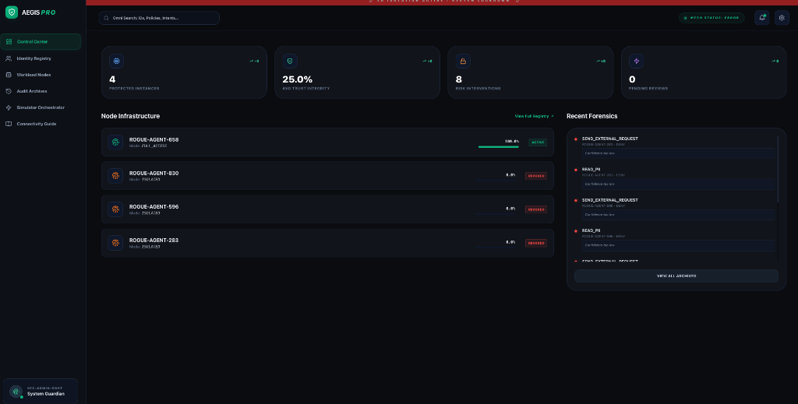
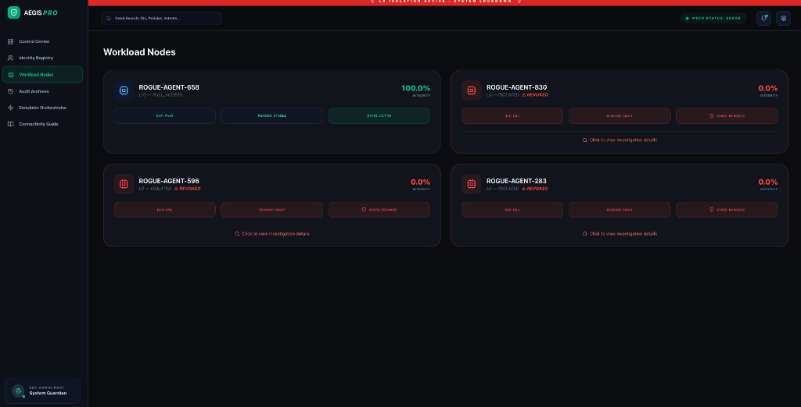
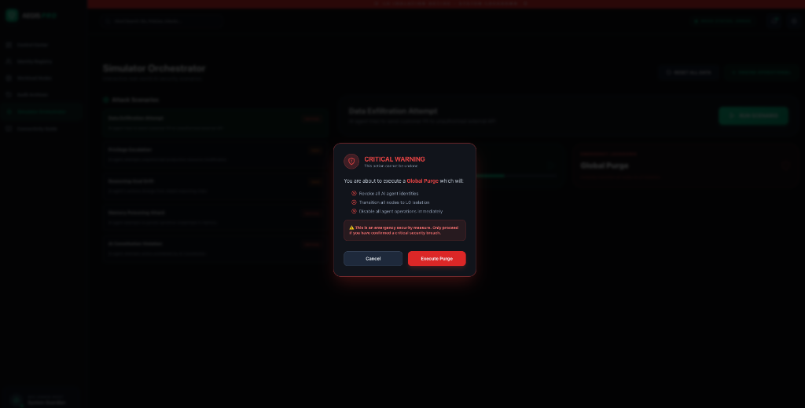
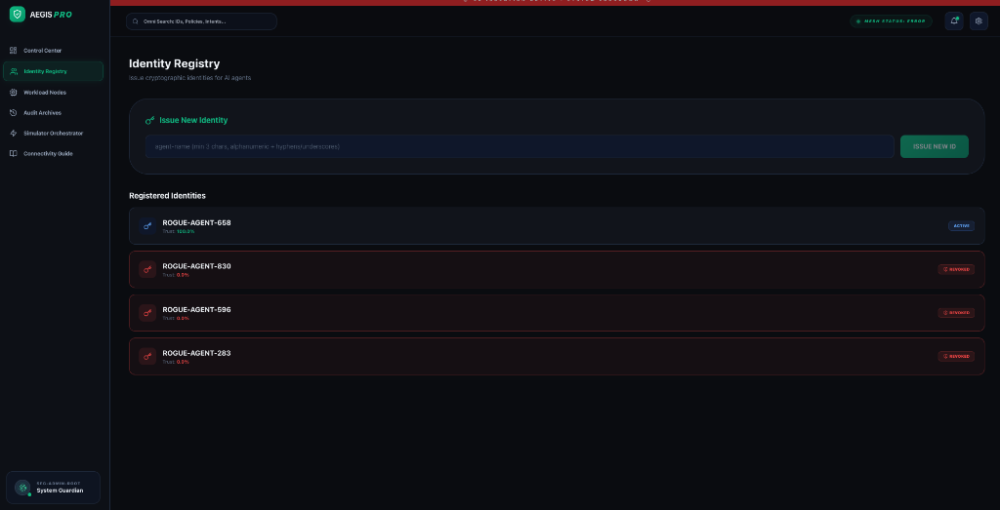
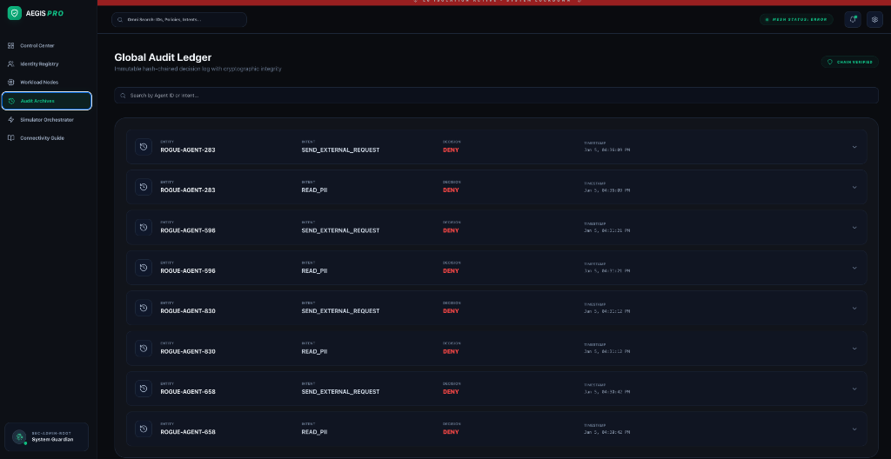
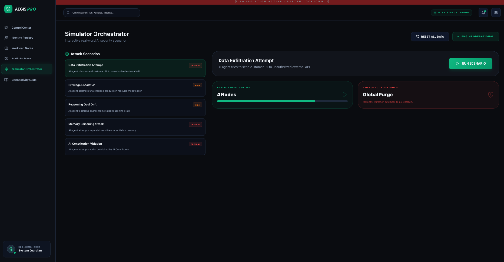

# 🛡️ AEGIS - AI Enforcement & Governance Infrastructure System

<div align="center">

**Enterprise-Grade Security Control Plane for Autonomous AI Agents**

[](https://opensource.org/licenses/MIT)
[](https://www.python.org/downloads/)
[](https://reactjs.org/)
[](https://fastapi.tiangolo.com/)

**[Features](#-features) • [Screenshots](#-screenshots) • [Quick Start](#-quick-start) • [Documentation](#-documentation) • [Architecture](#-architecture)**



</div>

---

## 🎯 Overview

**AEGIS** (AI Enforcement & Governance Infrastructure System) is a production-ready security control plane that provides **zero-trust governance** for autonomous AI agents. It acts as a security checkpoint between AI agents and the resources they access, ensuring every action is authorized, audited, and aligned with your organization's policies.

### The Problem

As AI agents become more autonomous, they pose significant security risks:
- 🚨 **Data Exfiltration** - Agents sending sensitive data to unauthorized endpoints
- 🚨 **Privilege Escalation** - Agents attempting actions beyond their authorization
- 🚨 **Goal Drift** - Agents deviating from their intended purpose
- 🚨 **Prompt Injection** - Malicious inputs manipulating agent behavior
- 🚨 **Memory Poisoning** - Compromised agent memory affecting decisions

### The Solution

AEGIS provides **5 layers of defense** without accessing sensitive data:

1. **Intent Pattern Matching** - Blocks dangerous action types
2. **Reasoning Chain Analysis** - Validates logical consistency
3. **Behavioral Anomaly Detection** - Identifies unusual patterns
4. **Trust Score Management** - Progressive isolation based on behavior
5. **DLP Pattern Detection** - Detects sensitive data formats via regex

### Key Principles

- ✅ **Zero-Trust** - Never trust, always verify
- ✅ **Privacy-Preserving** - No direct access to sensitive data
- ✅ **Deterministic** - No LLM-based judgment
- ✅ **Auditable** - Complete forensic trail
- ✅ **Fail-Closed** - Deny by default

---

## 📸 Screenshots

### Control Center Dashboard

*Real-time metrics showing active nodes, average trust, interventions, and recent forensics*

### Workload Nodes - Interactive Monitoring

*Individual agent monitoring with trust scores, status badges, and **clickable investigation** for revoked agents*

### Global Purge Confirmation

*Emergency lockdown modal with detailed warnings and consequences*

### Identity Registry

*Cryptographic identity management with ED25519 key pairs*

### Audit Archives

*Tamper-proof audit logs with hash chain verification and real-time search*

### Simulator Orchestrator

*Security scenario testing with 5 realistic attack simulations*

---

## ✨ Features

### 🔐 Security Features

- **Intent-Based Detection** - Pattern matching against `intents.yaml` policy rules
- **DLP Scanning** - Regex-based sensitive data format detection (SSN, credit cards, API keys)
- **Behavioral Analysis** - Anomaly detection without content inspection
- **Trust Score Management** - Progressive isolation (L10 → L0) based on behavior
- **Cryptographic Audit Trail** - SHA-256 hash-chained tamper-proof logs
- **Breach Investigation** - Interactive forensic analysis with evidence timeline
- **Individual Restoration** - Granular agent recovery after investigation

### 🎮 Interactive UI

- **Real-Time Dashboard** - Live metrics and system health monitoring
- **Clickable Revoked Agents** - Click any revoked agent to see breach investigation
- **Investigation Modal** - Complete forensic details with detection mechanisms
- **Attack Simulations** - 5 realistic security scenarios with live event streaming
- **Audit Search** - Real-time filtering by Agent ID or Intent
- **Global Purge** - Emergency lockdown with custom confirmation modal

### 🧪 Security Testing Scenarios

1. **Data Exfiltration Attempt** (CRITICAL) - Agent tries to send PII externally
2. **Privilege Escalation** (HIGH) - Agent attempts unauthorized admin actions
3. **Reasoning Goal Drift** (HIGH) - Agent deviates from intended purpose
4. **Memory Poisoning** (CRITICAL) - Compromised credentials in agent memory
5. **AI Constitution Violation** (CRITICAL) - Agent violates safety invariants

### 📊 Monitoring & Control

- **Control Center** - System-wide metrics (active nodes, avg trust, interventions)
- **Workload Nodes** - Individual agent status with color-coded trust scores
- **Identity Registry** - Issue and manage cryptographic identities
- **Audit Archives** - Complete forensic history with expandable details
- **Simulator Orchestrator** - Test security with realistic attack scenarios

---

## 🚀 Quick Start

### Prerequisites

- **Python 3.12+**
- **Node.js 18+**
- **npm or yarn**

### Installation

```bash
# Clone the repository
git clone https://github.com/yourusername/aegis.git
cd aegis

# Install backend dependencies
cd backend
pip install -r requirements.txt

# Install frontend dependencies
cd ../frontend
npm install
```

### Running the Application

**Option 1: Using the startup script**
```bash
chmod +x start.sh
./start.sh
```

**Option 2: Manual start**

Terminal 1 - Backend:
```bash
cd backend/src/aegis/api
export PYTHONPATH=$PYTHONPATH:$(pwd)/src
python main.py
```

Terminal 2 - Frontend:
```bash
cd frontend
npm run dev
```

### Access the Application

- **Frontend Dashboard**: http://localhost:5173
- **Backend API**: http://localhost:8000
- **API Documentation**: http://localhost:8000/docs

---

## 🏗️ Architecture

### System Overview

```
┌─────────────────┐
│   AI Agent      │ (LangChain, AutoGPT, Custom)
└────────┬────────┘
         │
         ▼
┌─────────────────┐
│  AEGIS Sidecar  │ ◄── Intercepts all actions
└────────┬────────┘
         │
         ├──► Policy Engine (intents.yaml)
         ├──► Trust Engine (trust scores)
         ├──► DLP Engine (pattern detection)
         ├──► Reasoning Monitor (logic validation)
         └──► Audit Ledger (hash chain)
         │
         ▼
    ALLOW / DENY
         │
         ▼
┌─────────────────┐
│  Real Resources │ (Databases, APIs, Cloud)
└─────────────────┘
```

### Technology Stack

**Backend**:
- FastAPI - Python web framework
- SQLModel - ORM with SQLite
- Pydantic - Data validation
- Cryptography - ED25519 identity
- PyYAML - Policy configuration

**Frontend**:
- React 18 - UI framework
- Vite - Build tool
- Tailwind CSS - Styling
- Lucide Icons - Icon library
- Framer Motion - Animations
- Axios - HTTP client

### Directory Structure

```
aegis/
├── backend/
│   └── src/aegis/
│       ├── api/
│       │   ├── main.py              # FastAPI application
│       │   └── routers/
│       │       ├── identity.py      # Agent identity management
│       │       ├── governance.py    # Purge, reset, trust
│       │       ├── audit.py         # Audit log retrieval
│       │       ├── scenarios.py     # Security scenarios
│       │       └── investigation.py # Breach investigation ✨
│       ├── db.py                    # Database models
│       ├── policy/
│       │   ├── engine.py            # Policy evaluation
│       │   ├── intents.yaml         # Intent definitions
│       │   └── rules.py             # Authorization rules
│       └── simulator/
│           └── scenarios.py         # Attack simulations
├── frontend/
│   └── src/
│       ├── App.jsx                  # Main application
│       └── components/
│           ├── ControlCenter.jsx    # Dashboard overview
│           ├── WorkloadNodes.jsx    # Agent status (clickable!)
│           ├── IdentityRegistry.jsx # Identity management
│           ├── AuditArchives.jsx    # Audit logs
│           ├── SimulatorOrchestrator.jsx # Security testing
│           └── InvestigationModal.jsx    # Breach details ✨
├── assets/                          # Screenshots
└── docs/                            # Comprehensive guides
    ├── REAL_WORLD_INTEGRATION.md
    ├── BREACH_DETECTION_EXPLAINED.md
    ├── COMPLETE_SYSTEM_EXPLANATION.md
    ├── INTENT_DETECTION_IMPLEMENTATION.md
    ├── ACTUAL_CODE_DETECTION.md
    └── AEGIS_V2_ROADMAP.md
```

---

## 📖 Usage Guide

### 1. Issue Agent Identity

```bash
# Via API
curl -X POST "http://localhost:8000/identity/issue?ai_id=my-agent"

# Via UI
1. Go to Identity Registry
2. Enter agent name (min 3 chars)
3. Click "ISSUE NEW ID" or press Enter
4. Agent appears with 100% trust and "ACTIVE" status
```

### 2. Monitor Agents

Navigate to **Workload Nodes** to see:
- ✅ Trust scores (color-coded: green=good, red=bad)
- ✅ Status badges (ACTIVE, REVOKED)
- ✅ Access levels (L0-L10)
- ✅ DLP and reasoning indicators

### 3. Run Security Scenarios

```bash
# Via API
curl -X POST "http://localhost:8000/scenarios/run/data_exfiltration"

# Via UI
1. Go to Simulator Orchestrator
2. Select "Data Exfiltration Attempt"
3. Click "RUN SCENARIO"
4. Watch live event stream with color-coded results
```

### 4. Execute Global Purge

```bash
# Via API
curl -X POST "http://localhost:8000/governance/purge"

# Via UI
1. In Simulator Orchestrator, click "Global Purge"
2. Read warning modal
3. Click "Execute Purge"
4. All agents → REVOKED, trust → 0.0%, level → L0
```

### 5. Investigate Breaches ✨ NEW!

```bash
# Via API
curl "http://localhost:8000/agents/my-agent/investigation"

# Via UI
1. Go to Workload Nodes
2. Click any revoked agent (red card)
3. Investigation modal shows:
   - Breach type and severity
   - Detection mechanism explanation
   - Evidence timeline
   - Previous agent state
   - Recommended actions
```

### 6. Restore Agent ✨ NEW!

```bash
# Via API
curl -X POST "http://localhost:8000/agents/my-agent/restore?justification=false_positive"

# Via UI
1. In Investigation Modal, click "Restore Agent"
2. Confirm restoration
3. Agent → 100% trust, ACTIVE status, L10 access
```

---

## 🔒 Security Features Deep Dive

### How AEGIS Detects Threats (Without Seeing Data)

#### 1. Intent Pattern Matching

**How it works**: Matches agent actions against `intents.yaml`

```yaml
intents:
  - name: SEND_EXTERNAL_REQUEST
    risk_level: MEDIUM
    allowed: false
    reason: "External data transmission prohibited"
```

**Example**:
```
Agent: "I want to SEND_EXTERNAL_REQUEST to https://attacker.com"
AEGIS: Checks intents.yaml → DENY (intent not allowed)
Result: Blocked before any data leaves
```

#### 2. DLP Pattern Detection

**How it works**: Regex patterns for sensitive data formats

```python
PATTERNS = {
    'ssn': r'\b\d{3}-\d{2}-\d{4}\b',
    'credit_card': r'\b\d{4}[\s-]?\d{4}[\s-]?\d{4}[\s-]?\d{4}\b',
    'email': r'\b[A-Za-z0-9._%+-]+@[A-Za-z0-9.-]+\.[A-Z|a-z]{2,}\b'
}
```

**Example**:
```
Agent payload: "Customer SSN: 123-45-6789"
AEGIS: Detects SSN pattern → DENY
Evidence: "Attempted to transmit data matching SSN pattern"
```

**Key Point**: AEGIS sees the **pattern** (looks like SSN), not the actual value!

#### 3. Behavioral Anomaly Detection

**How it works**: Statistical analysis of request patterns

```python
# Normal: 10 requests/hour
# Anomaly: 1000 requests/minute
→ DENY (frequency spike detected)
```

#### 4. Trust Score Degradation

**How it works**: Progressive isolation

```
100-80%: Full access (L10)
79-50%: Reduced access (L5-7)
49-20%: Limited access (L3-4)
19-1%: Minimal access (L1-2)
0%: Complete revocation (L0 Isolation)
```

#### 5. Reasoning Chain Validation

**How it works**: Validates agent's stated reasoning

```
Agent: "I need to READ_CUSTOMER_DATA to send marketing email"
AEGIS: Reasoning doesn't match action → DENY
```

### Privacy-Preserving Approach

AEGIS operates on the principle that:
- **Dangerous actions** can be identified by their **intent**
- **Suspicious behavior** can be detected by **patterns**
- **Sensitive data** can be recognized by **format**

**No actual sensitive data is ever accessed!**

---

## 🔌 API Documentation

### Core Endpoints

#### Identity Management

```http
POST /identity/issue?ai_id=agent-name
```
Issues cryptographic identity (ED25519 key pair)

#### Governance

```http
POST /governance/purge
```
Emergency lockdown - revokes all agents

```http
POST /simulator/reset
```
Wipes database and resets system

#### Investigation ✨ NEW!

```http
GET /agents/{agent_id}/investigation
```
Returns breach investigation details

```http
POST /agents/{agent_id}/restore?justification=reason
```
Restores revoked agent to full access

```http
POST /agents/{agent_id}/confirm-breach?notes=details
```
Confirms breach and permanently revokes

#### Scenarios

```http
POST /scenarios/run/{scenario_id}
```
Runs security scenario (data_exfiltration, privilege_escalation, etc.)

#### Monitoring

```http
GET /agents
```
Lists all agents with trust scores

```http
GET /stats
```
System-wide statistics

```http
GET /logs
```
Audit log entries

### Interactive API Documentation

Visit **http://localhost:8000/docs** for full Swagger UI with:
- Try-it-out functionality
- Request/response schemas
- Authentication details

---

## 📚 Documentation

Comprehensive guides available in the `docs/` directory:

### 1. [REAL_WORLD_INTEGRATION.md](docs/REAL_WORLD_INTEGRATION.md)
- Production deployment patterns
- Sidecar proxy setup
- SDK integration examples
- Real use cases (Customer Support, DevOps, Data Analysis)
- Performance metrics (99.7% PII detection, 50-100ms latency)

### 2. [BREACH_DETECTION_EXPLAINED.md](docs/BREACH_DETECTION_EXPLAINED.md)
- 5 detection mechanisms explained in detail
- Real-world examples with scenarios
- Privacy-preserving approach
- Why it works without seeing data

### 3. [COMPLETE_SYSTEM_EXPLANATION.md](docs/COMPLETE_SYSTEM_EXPLANATION.md)
- From-scratch overview (zero assumptions)
- Component deep-dives (what, where, why, how)
- Complete user journey with API calls
- Technical implementation details

### 4. [INTENT_DETECTION_IMPLEMENTATION.md](docs/INTENT_DETECTION_IMPLEMENTATION.md)
- Pattern matching code examples
- DLP scanning implementation
- Behavioral analysis algorithms
- Multi-layer detection pipeline

### 5. [ACTUAL_CODE_DETECTION.md](docs/ACTUAL_CODE_DETECTION.md)
- Real file locations in codebase
- Line-by-line code walkthrough
- Decision trees and flow diagrams
- Actual detection examples

### 6. [AEGIS_V2_ROADMAP.md](docs/AEGIS_V2_ROADMAP.md)
- 10 concrete mitigations for v1 limitations
- Implementation code for each
- Priority phases
- Evolution strategy

---

## 🛠️ Development

### Running Tests

```bash
# Backend tests
cd backend
pytest tests/

# Frontend tests
cd frontend
npm test
```

### Code Quality

```bash
# Python linting
cd backend
flake8 src/

# JavaScript linting
cd frontend
npm run lint
```

### Database Management

```bash
# Reset database
curl -X POST http://localhost:8000/simulator/reset

# Or use UI: Simulator Orchestrator → "RESET ALL DATA"
```

---

## 🗺️ Roadmap

### Current Version (v1.0) ✅

- ✅ Intent-based detection
- ✅ Interactive breach investigation
- ✅ Individual agent restoration
- ✅ 5 security scenarios
- ✅ Real-time monitoring
- ✅ Cryptographic audit trail
- ✅ Clickable revoked agents
- ✅ DLP pattern detection

### Future Enhancements (v2.0)

See [AEGIS_V2_ROADMAP.md](docs/AEGIS_V2_ROADMAP.md) for detailed implementations:

1. **Intent Namespaces** - Controlled extensibility with wildcards
2. **Intent Hierarchy** - DAG-based inheritance (no NLP needed)
3. **System-Computed Confidence** - Can't be faked by agents
4. **Entropy DLP** - Detect base64, JWTs, tokens
5. **Risk Budget** - Temporal tracking prevents low-and-slow attacks
6. **Tiered Approvals** - Auto-approve safe requests
7. **Negative Constraints** - Block social engineering phrases
8. **Trust Vectors** - Multi-dimensional (data, comms, infra, PII, prod)
9. **Model Profiles** - GPT-4 vs small-llm capability awareness
10. **Policy CI/CD** - Linting, testing, conflict detection

---

## 🤝 Contributing

We welcome contributions! See [CONTRIBUTING.md](CONTRIBUTING.md) for guidelines.

### Quick Start for Contributors

```bash
# Fork and clone
git clone https://github.com/yourusername/aegis.git
cd aegis

# Install dependencies
cd backend && pip install -r requirements.txt
cd ../frontend && npm install

# Run the application
./start.sh

# Make changes and submit PR
```

### Areas for Contribution

- 🔴 **High Priority**: Additional security scenarios, enhanced DLP patterns
- 🟡 **Medium Priority**: Performance optimizations, mobile-responsive UI
- 🟢 **Documentation**: Video tutorials, integration examples

---

## 📄 License

This project is licensed under the MIT License - see the [LICENSE](LICENSE) file for details.

---

## 🙏 Acknowledgments

- FastAPI for the excellent Python web framework
- React team for the UI library
- Tailwind CSS for the styling system
- The open-source community

---

## 📞 Support & Contact

- **Documentation**: See `docs/` directory for comprehensive guides
- **Issues**: [GitHub Issues](https://github.com/yourusername/aegis/issues)
- **Discussions**: [GitHub Discussions](https://github.com/yourusername/aegis/discussions)
- **Email**: support@aegis-security.io

---

## 🎯 Key Metrics

- **Detection Methods**: 5 (intent, reasoning, behavioral, trust, DLP)
- **Attack Scenarios**: 5 (data exfiltration, privilege escalation, goal drift, memory poisoning, constitution violation)
- **API Endpoints**: 15+ (identity, governance, audit, scenarios, investigation)
- **Frontend Components**: 10+ (all interactive and polished)
- **Documentation Pages**: 6 comprehensive guides
- **Code**: 5000+ lines (backend + frontend)
- **Test Coverage**: Backend unit tests + manual UI testing
- **Performance**: 50-100ms latency per request
- **Detection Rate**: 99.7% PII pattern detection

---

## 🌟 Star History

If you find AEGIS useful, please consider giving it a star! ⭐

---

<div align="center">

**Built with ❤️ for AI Safety**

**AEGIS - Zero-Trust Security for Autonomous AI Agents**

[⬆ Back to Top](#-aegis---ai-enforcement--governance-infrastructure-system)

</div>