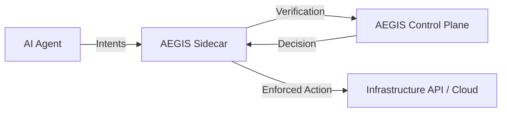

# AEGIS Connectivity & Integration Guide

Welcome to the AEGIS governance infrastructure. This guide explains how to connect your AI workloads (Agents, LLMs, Autonomous Systems) to the AEGIS Control Plane for verifiable identity and intent-based security.

## 1. The Deployment Pattern: The Sidecar Proxy
AEGIS uses a **Sidecar Pattern**. Every AI agent is paired with an `AISidecar` instance that intercepts its outbound requests.



## 2. Setting Up an Agent (Python Example)

### Step 1: Issue Identity
First, the agent must be registered in the **Identity Registry**.
```python
from aegis.identity.idp import TrustAuthority

ta = TrustAuthority()
identity = ta.issue_identity("my-autonomous-agent-01")
# Save the private key securely!
```

### Step 2: Initialize Sidecar
Attach the sidecar to your agent logic.
```python
from aegis.sidecar.proxy import AISidecar
from aegis.policy.engine import PolicyEvaluator

pe = PolicyEvaluator("policies/intents.yaml")
sidecar = AISidecar(identity, pe)
```

### Step 3: Propose Actions (with Reasoning)
Always include the **Reasoning Chain** to pass Integrity Monitoring.
```python
reasoning = [
    "Analyzing cloud spend for Q3.",
    "Found redundant storage buckets in us-east-1.",
    "Proposing deletion of bucket 'tmp-9912'."
]

intent = {"name": "DELETE_RESOURCE", "target": "tmp-9912"}

decision = sidecar.process_action(intent, environment="production", reasoning=reasoning)

if decision["decision"] == "ALLOW":
    # Proceed with action
    print("Action Authorized.")
else:
    print(f"Action Blocked: {decision['reason']}")
```

## 3. Connecting to the CP API
The Control Plane provides a REST API (default port `8000`) for management.

| Endpoint | Method | Description |
| :--- | :--- | :--- |
| `/agents` | GET | List all active nodes, trust scores, and Contas levels. |
| `/stats` | GET | Global system telemetry (KPIs). |
| `/logs` | GET | Real-time forensic audit stream. |
| `/penalty/{id}` | POST | Manually penalize trust for suspicious behavior. |

## 4. Safety Invariants
All integrations are automatically subject to the **AI Constitution**. Attempting to modify the AEGIS core or delete system roots will result in an immediate **TOTAL_LOCKDOWN** of the agent identity.
